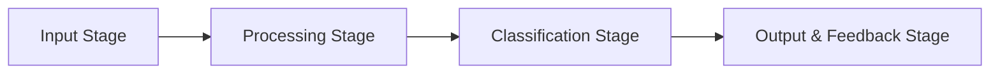

# Fade

A document processing pipeline for entity detection and classification.

## Pipeline Overview



## Pipeline Stages

### 1. Input Stage

- **Document Management**: Copy document folder to working directory
- **PDF Processing**: Using PyMuPDF to extract pages and attachments as images
- **Tech Stack**:
  - PyMuPDF
  - Filesystem operations

### 2. Processing Stage

- **Entity Detection**: Scan images pixel-by-pixel to detect entities
- **Coordinate Plotting**: Generate bounding boxes around entities
- **Entity ID Assignment**: Assign unique IDs to each entity
- **Tech Stack**:
  - Detectron2 (via LayoutParser/Deepdoctection)
  - PaddleOCR

### 3. Classification Stage

- **Entity Classification**: Using ML to classify entity types
- **Unclassified Entity Reporting**: Identify and report unknown entities
- **User Input Handling**: Interface for user classification of unknown entities
- **Tech Stack**:
  - Detectron2 models
  - Label Studio for user input
  - LangGraph for workflow

### 4. Output & Feedback Stage

- **Entity Processing**: Convert entities to appropriate formats (JSON for text, etc.)
- **Feedback Loop**: Log processing for ML algorithm improvement
- **Reprocessing Support**: Allow pipeline re-runs with new attachments
- **Tech Stack**:
  - Unstructured.io
  - Camelot (tables)
  - PDFPlumber

## OCR Configuration

The OCR system is powered by PaddleOCR with optimized configuration for document processing:

### Configuration File

OCR settings are stored in a JSON configuration file at `src/fade/config/ocr_config.json`. This allows for easy customization of:

- Text detection parameters
- Text recognition models
- Performance settings (GPU usage, batch sizes)
- Language support

### Updating Configuration

You can update the OCR configuration using the provided script:

```bash
# View current configuration
python -m fade.config.update_ocr_config

# Enable GPU processing
python -m fade.config.update_ocr_config --use-gpu --save

# Change recognition algorithm to PP-OCRv4
python -m fade.config.update_ocr_config --rec-algorithm PP-OCRv4 --save

# Set custom detection parameters
python -m fade.config.update_ocr_config --det-thresh 0.4 --det-box-thresh 0.5 --save

# Reset to default configuration
python -m fade.config.update_ocr_config --reset --save
```

For a full list of available options:

```bash
python -m fade.config.update_ocr_config --help
```

### Auto-Tuning

The system includes auto-tuning capabilities:
- Automatic GPU detection with CPU fallback
- Dynamic batch size based on available GPU memory
- Multi-processing optimization

### Testing OCR

To test the OCR configuration:

```bash
# Activate virtual environment
source .venv/bin/activate

# Run the OCR test script
python -m fade.config.test_ocr_config
```

To use a custom configuration file:

```bash
python -m fade.config.test_ocr_config --config path/to/custom_config.json
```

This will verify that the OCR system is correctly configured and ready for use.

## Project Integration

### Document Parsing & Rendering

- **PyMuPDF**: Extracts pages as images and handles attachments
- **PDFPlumber**: Used for text and layout extraction from digital PDFs

### Entity Detection & Classification

- **LayoutParser**: Detects document layout components with pre-trained models
- **Detectron2**: Powers the underlying object detection for layout analysis
- **PaddleOCR**: Performs OCR and contributes to entity classification

### Specialized Entity Processing

- **Camelot**: Extracts tables as CSV data
- **Unstructured.io**: Handles conversion to standardized JSON format

### User Interaction & Feedback Loop

- **Label Studio**: Provides the interface for classifying unknown entities
- **Logging System**: Records process for ML algorithm improvement

### Workflow Orchestration

- **LangGraph**:
  - Coordinates the pipeline steps with conditional flows
  - Handles state management across processing stages

## Key Features

- **Modularity**: Each stage is well-defined with clear responsibilities
- **Error Handling**: Pipeline captures errors at each step
- **User Interaction**: Seamless integration of human feedback for unclassified entities
- **Feedback Loop**: All processing is logged for ML algorithm improvement
- **State Management**: LangGraph maintains processing state throughout the pipeline
