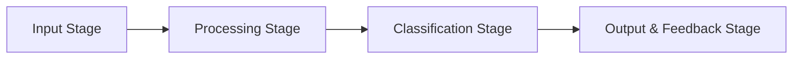

# Fade

A document processing pipeline for entity detection and classification.

## Pipeline Overview

## Pipeline Stages

### 1. Input Stage
- **Document Management**: Copy document folder to working directory
- **PDF Processing**: Using PyMuPDF to extract pages and attachments as images
- **Tech Stack**: 
  - PyMuPDF
  - Filesystem operations

### 2. Processing Stage
- **Entity Detection**: Scan images pixel-by-pixel to detect entities
- **Coordinate Plotting**: Generate bounding boxes around entities
- **Entity ID Assignment**: Assign unique IDs to each entity
- **Tech Stack**:
  - Detectron2 (via LayoutParser/Deepdoctection)
  - PaddleOCR

### 3. Classification Stage
- **Entity Classification**: Using ML to classify entity types
- **Unclassified Entity Reporting**: Identify and report unknown entities
- **User Input Handling**: Interface for user classification of unknown entities
- **Tech Stack**:
  - Detectron2 models
  - Label Studio for user input
  - LangGraph for workflow

### 4. Output & Feedback Stage
- **Entity Processing**: Convert entities to appropriate formats (JSON for text, etc.)
- **Feedback Loop**: Log processing for ML algorithm improvement
- **Reprocessing Support**: Allow pipeline re-runs with new attachments
- **Tech Stack**:
  - Unstructured.io
  - Camelot (tables)
  - PDFPlumber

## Project Integration

### Document Parsing & Rendering
- **PyMuPDF**: Extracts pages as images and handles attachments
- **PDFPlumber**: Used for text and layout extraction from digital PDFs

### Entity Detection & Classification
- **LayoutParser**: Detects document layout components with pre-trained models
- **Detectron2**: Powers the underlying object detection for layout analysis
- **PaddleOCR**: Performs OCR and contributes to entity classification

### Specialized Entity Processing
- **Camelot**: Extracts tables as CSV data
- **Unstructured.io**: Handles conversion to standardized JSON format

### User Interaction & Feedback Loop
- **Label Studio**: Provides the interface for classifying unknown entities
- **Logging System**: Records process for ML algorithm improvement

### Workflow Orchestration
- **LangGraph**: 
  - Coordinates the pipeline steps with conditional flows
  - Handles state management across processing stages

## Key Features

- **Modularity**: Each stage is well-defined with clear responsibilities
- **Error Handling**: Pipeline captures errors at each step
- **User Interaction**: Seamless integration of human feedback for unclassified entities
- **Feedback Loop**: All processing is logged for ML algorithm improvement
- **State Management**: LangGraph maintains processing state throughout the pipeline
